```mermaid
classDiagram
    %% MCP Config Interfaces
    class IMcpConfig {
      <<interface>>
      +getConfig() : IMcpConfig
      +updateServerConfig(serverName: string, newConfig: object): void
    }
    class ConfigurationManager {
      +initialize() : Promise<void>
      +addServer(serverName: string, config: ServerConfig): Promise<void>
      +removeServer(serverName: string): Promise<void>
      +updateServerConfig(serverName: string, newConfig: ServerConfig): Promise<void>
      +getServerConfig(serverName: string): ServerConfig | undefined
      +getAllServers() : Array<name, config>
    }
    ConfigurationManager ..|> IMcpConfig

    %% MCP Client Interfaces
    class IMcpClient {
      <<interface>>
      +processMessage(message: string) : Promise<string>
      +sendRequest(request: McpRequest) : Promise<McpResponse>
    }
    class McpClient {
      +connect() : Promise<void>
      +processMessage(message: string) : Promise<string>
      +sendRequest(request: McpRequest) : Promise<McpResponse>
      +sendNotification(notification: IMcpMessage) : Promise<void>
      +disconnect() : Promise<void>
    }
    McpClient ..|> IMcpClient

    %% LLM Provider Interfaces
    class ILLMProvider {
      <<interface>>
      +sendRequest(payload: LLMRequest): Promise<LLMResponse>
      +getResponse(): Promise<LLMResponse>
    }
    class AnthropicClient {
      +initialize() : Promise<void>
      +setApiKey(apiKey: string): Promise<void>
      +sendRequest(payload: LLMRequest): Promise<LLMResponse>
      +getResponse(): Promise<LLMResponse>
    }
    AnthropicClient ..|> ILLMProvider

    %% MCP Server Interfaces
    class IMcpServer {
      <<interface>>
      +connect(options?: ConnectionOptions): Promise<void>
    }
    class McpServer {
      -status: ServerStatus
      -container: Container
      -capabilities: ServerCapabilities
      +connect(options?: object): Promise<void>
      +disconnect(): Promise<void>
      +getStatus(): ServerStatus
      +getCapabilities(): ServerCapabilities
      +getName(): string
      +getConfig(): ServerConfig
    }
    McpServer ..|> IMcpServer
    McpServer --> ServerConfig : uses
    McpServer --> ServerCapabilities : obtains
    McpServer --> ContainerManager : controls
    McpServer --> Container : manages

    %% Server Factory & Transport (Contracts only)
    class IMcpServerFactory {
      <<interface>>
      +createServer(config: ServerConfig): IMcpServer
    }
    class IMcpTransport {
      <<interface>>
      +send(data: TransportData): Promise<TransportResponse>
      +receive(): Promise<TransportData>
    }

    %% Message & Persistence Types
    class IMcpMessage {
      <<interface>>
      +id: string
      +type: 'request' | 'response' | 'notification'
      +payload: object
    }
    class IMcpDao {
      <<interface>>
      +save(message: IMcpMessage): Promise<void>
      +load(id: string): Promise<IMcpMessage>
    }

    %% Request / Response Types
    class McpRequest {
      <<type>>
      +type: string
      +payload: object
    }
    class McpResponse {
      <<type>>
      +status: 'success' | 'error'
      +data: object
      +error?: string
    }
    class McpNotification {
      <<type>>
      +type: string
      +payload: object
    }
    McpClient --> McpRequest : sends
    McpClient --> McpResponse : receives
    McpClient --> McpNotification : notifies

    %% LLM Request / Response Types
    class LLMRequest {
      <<type>>
      +messages: Array< role: string, content: string >
      +temperature?: number
      +model?: string
    }
    class LLMResponse {
      <<type>>
      +content: string
      +role: 'assistant'
      +metadata?: object
    }
    AnthropicClient --> LLMRequest : sends
    AnthropicClient --> LLMResponse : receives

    %% Transport Types
    class TransportData {
      <<type>>
      +type: 'request' | 'response' | 'notification'
      +payload: object
    }
    class TransportResponse {
      <<type>>
      +success: boolean
      +data?: object
      +error?: string
    }

    %% Connection & Server Details
    class ConnectionOptions {
      <<type>>
      +timeout?: number
      +retryAttempts?: number
      +secure?: boolean
    }
    class ServerConfig {
      <<type>>
      +name: string
      +command: string
      +args: string[]
      +env?: object
      +workingDir?: string
      +resources?: ResourceConfig[]
      +tools?: ToolConfig[]
    }
    class ServerInfo {
      <<type>>
      +name: string
      +status: ServerStatus
      +capabilities: ServerCapabilities
      +version: string
    }
    class ServerCapabilities {
      <<type>>
      +supportedTools: string[]
      +maxConcurrentRequests: number
      +supportedTransports: string[]
    }
    class ResourceConfig {
      <<type>>
      +type: string
      +path: string
      +options?: object
    }
    class ToolConfig {
      <<type>>
      +name: string
      +description: string
      +parameters: object
    }

    %% Error Type
    class McpError {
      <<type>>
      +code: ErrorCode
      +details?: any
    }

    %% Container and Manager Types
    class ContainerConfig {
      <<type>>
      +image: string
      +command: string
      +args?: string[]
      +env?: object
      +workingDir?: string
    }
    class ExecResult {
      <<type>>
      +exitCode: number
      +stdout: string
      +stderr: string
    }
    class Container {
      <<interface>>
      +id: string
      +name: string
      +status: ServerStatus
      +start(): Promise<void>
      +stop(): Promise<void>
      +exec(command: string): Promise<ExecResult>
    }
    class ContainerManager {
      <<interface>>
      +createContainer(name: string, config: ContainerConfig): Promise<Container>
      +removeContainer(name: string): Promise<void>
      +listContainers(): Promise<Container[]>
    }
    class PodmanContainerManager {
      +createContainer(name: string, config: ContainerConfig): Promise<Container>
      +removeContainer(name: string): Promise<void>
      +listContainers(): Promise<Container[]>
      +startServer(serverName: string): Promise<Container>
      +stopServer(serverName: string): Promise<void>
    }
    PodmanContainerManager ..|> ContainerManager
    Container --> ExecResult : exec() returns
    PodmanContainerManager ..> ContainerConfig : uses
    ConfigurationManager --> ServerConfig : persists
```

Below is an overview of how the MCP‐related interfaces defined in our codebase are used and the classes that implement them. In summary:

• IMcpConfig  
 – Defined in interfaces.ts to manage server configuration.  
 – Implemented by the ConfigurationManager (in services/ConfigurationManager.ts), which is responsible for initializing, adding, removing, and updating server configurations (using ServerConfig as the concrete type).

• IMcpClient  
 – Provides an abstraction for client–server communication (processing messages and sending requests).  
 – Implemented by McpClient (in services/McpClient.ts) where it sends McpRequest objects and obtains McpResponse results (and also sends McpNotification via its notify method).  
 – Uses types McpRequest, McpResponse, and McpNotification, as well as IMcpMessage (for notification messages).

• ILLMProvider  
 – Represents a provider for language model (LLM) capabilities.  
 – Implemented by AnthropicClient (in services/AnthropicClient.ts) which receives LLMRequest payloads and returns LLMResponse objects.

• IMcpServer  
 – Defines the contract for an MCP server (with a connect method that accepts ConnectionOptions).  
 – Implemented by McpServer (in services/McpServer.ts) which, upon connection, creates a container (using a ContainerManager) to serve an MCP instance. It also uses ServerConfig (its configuration) and parses ServerCapabilities from the container’s exec output.

• IMcpServerFactory  
 – Specifies a factory API to create IMcpServer instances given a ServerConfig.  
 – Although defined in interfaces.ts, no concrete implementing class is shown in the provided snippets (the pattern is available for when a server factory is needed).

• IMcpTransport  
 – Defines the transport contract (send/receive of TransportData and TransportResponse).  
 – This abstraction (and the underlying types TransportData and TransportResponse) is set up for the lower‐level communication but no concrete implementation is shown in our snippets.

• IMcpMessage  
 – A type representing a generic MCP message (request/response/notification).  
 – It is used by McpClient (for example in its sendNotification method).

• IMcpDao  
 – Provides an interface for persisting and loading MCP messages.  
 – Its implementation isn’t present in the provided code but it lays the ground for future persistence support.

• MCPRequest, McpResponse, and McpNotification  
 – These “data types” describe the shape of client requests, responses, and notifications.  
 – They are used by McpClient (for instance, processMessage sends a request and expects specific response data).

• LLMRequest and LLMResponse  
 – Used in LLM operations (for example, AnthropicClient’s sendRequest accepts an LLMRequest and returns an LLMResponse).

• TransportData and TransportResponse  
 – Are used by IMcpTransport to define low‐level payloads for communications.

• ConnectionOptions  
 – Used as an optional parameter for connecting an MCP server (see IMcpServer.connect).

• ServerConfig, ServerInfo, ServerCapabilities, ResourceConfig, ToolConfig  
 – ServerConfig is the configuration for launching a server (used by both McpServer and ConfigurationManager).  
 – When a server starts, its capabilities (ServerCapabilities) are queried.  
 – ResourceConfig and ToolConfig are nested types within ServerConfig to provide extra details about resources and tools.

• McpError  
 – A custom error type for MCP-related problems.  
 – Although defined here for uniform error handling, its usage would appear when throwing or handling errors in various services.

• ContainerConfig, ExecResult, Container, and ContainerManager  
 – These types specify the abstraction for container operations.  
 – McpServer uses a ContainerManager (injected via the constructor) to create (via PodmanContainerManager) and manage a Container which is then used to run the MCP server.  
 – The Container interface defines functions like start, stop, and exec (which returns an ExecResult).

The diagram below (in Mermaid syntax) shows the main classes and how they relate to the interfaces and types:

---

---

**Explanation of the Diagram:**

– The diagram shows the core MCP interfaces on the left as “contracts” (with the «interface» stereotype or as types).  
– Concrete implementations (like ConfigurationManager, McpClient, AnthropicClient, McpServer, and PodmanContainerManager) are shown inheriting from their respective interfaces.  
– Data types such as McpRequest/McpResponse/McpNotification and LLMRequest/LLMResponse are used by the client and LLM provider to handle message payloads and responses.  
– McpServer uses ServerConfig for configuration and fetches ServerCapabilities via container execution (using ContainerManager, which is implemented by PodmanContainerManager).  
– ConnectionOptions and various server detail types (ResourceConfig, ToolConfig, ServerInfo) support the server’s operation.

This structure clarifies how the extension uses these interfaces to manage the lifecycle of MCP servers (via containers), handle client/server communications, and integrate with an LLM provider.
